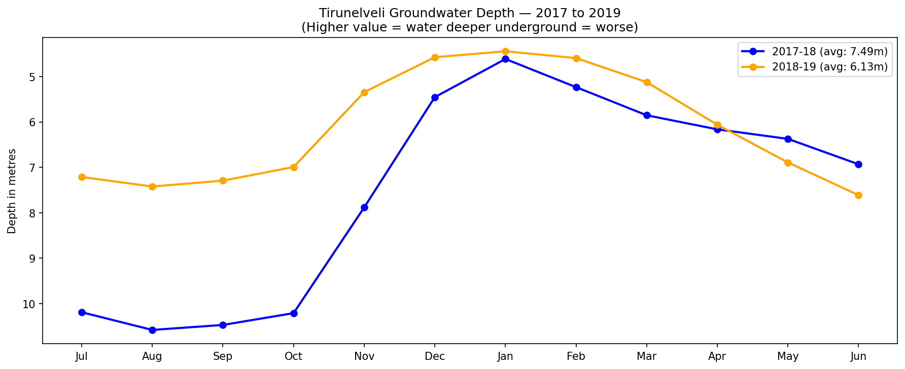
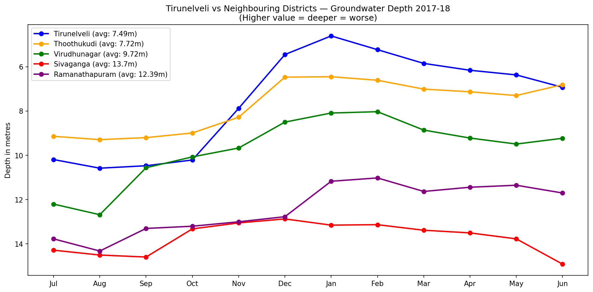

# Tirunelveli Groundwater Analysis (2017–2019)

**A data-driven investigation into groundwater depth trends in Tirunelveli 
and neighbouring districts of Tamil Nadu**

*By Jyosika S — Water-climate analyst in training*  
*Independent research | Data: Central Ground Water Board (CGWB)*

---

## Why This Matters

Tirunelveli sits on the Thamirabarani basin — Tamil Nadu's only 
perennial river. While most of India's river-fed districts assume 
water security, groundwater overextraction and erratic monsoons 
are quietly deepening the crisis even here.

This project uses open government data to ask: **how stressed is 
Tirunelveli's groundwater, and how does it compare to its neighbours?**

---

## Key Findings

- **Tirunelveli improved by 1.36 metres** between 2017-18 and 2018-19
  — suggesting successful monsoon recharge
- **August 2017 was the most severe month** — water table dropped 
  to 10.58 metres, the height of a 3-storey building underground
- **Seasonal stability improved dramatically** — the swing between 
  best and worst month reduced from 5.97m to 3.17m
- **Tirunelveli is the healthiest district** among its 5 neighbours 
  — likely protected by Thamirabarani river recharge
- Sivaganga (13.7m) and Ramanathapuram (12.39m) are nearly 
  **twice as stressed** as Tirunelveli — both lack perennial rivers

---

## Charts

### Tirunelveli Monthly Groundwater Depth (2017–2019)

### Tirunelveli vs Neighbouring Districts (2017-18)

---

## Data Source

| Source | Dataset |
|---|---|
| Central Ground Water Board (CGWB) | Groundwater level by district, Tamil Nadu 2017-18 & 2018-19 |
| data.gov.in | Open government data portal |

Depth values are in metres below ground level.  
Higher value = deeper water table = greater stress.

---

## Tools Used

- Python (pandas, matplotlib)
- Google Colab

---

## About

I previously published independently on water governance in the 
Thamirabarani basin. This project extends that work with data 
analysis — connecting field observation to quantitative evidence.

This is part of my ongoing focus on water security, climate 
adaptation, and SDG 6.

📧 jyosika3000@gmail.com  
[LinkedIn](https://www.linkedin.com/in/jyosikas-5b3020346)

---
*Next steps: Add data from 2015–2023 for long-term trend analysis*
